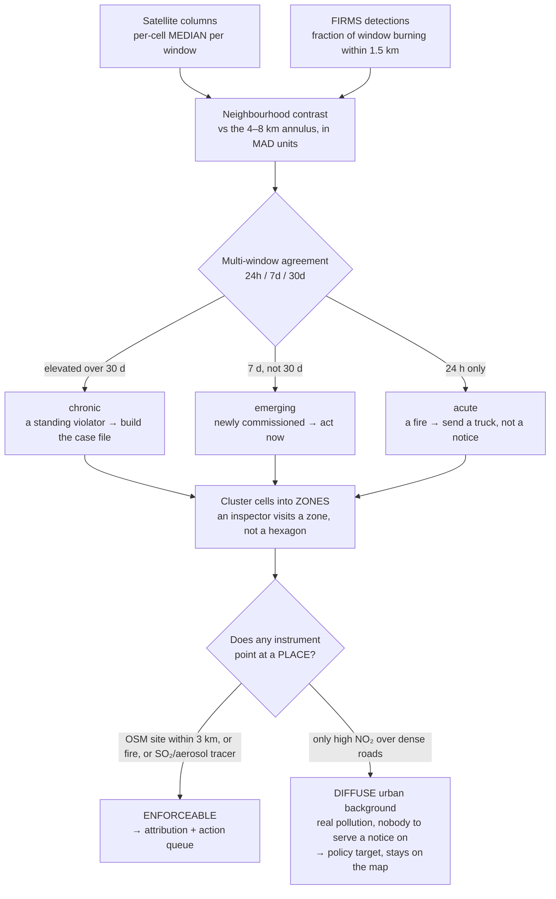

<h1 align="center">AQ Intelligence Platform</h1>

<p align="center">
  <em>From AQI dashboards to enforcement dispatch — signal → attribution → action.</em>
</p>

<p align="center">
  
  
  
  
  
  
  
</p>

**An air quality platform that names *who* is polluting, *where*, with *what
evidence*, and *what to do about it today* — not another map of how bad the air
is.**

India does not have a monitoring problem; it has an action problem. Over 900
CAAQMS stations exist, yet a 2024 CAG audit found only **31%** of monitored
cities had any actionable response protocol. Meanwhile the monitors themselves
lie about coverage: CPCB siting norms deliberately place them *away from
sources*, so the official map is a **measurement log, not a pollution census**.

This platform detects sources from instruments that cover **every cell equally**,
names them with an inspectable evidence chain, and reports honestly on what it
**cannot** see.

---

## Run it in under a minute

No API keys. No cloud account. The whole pipeline runs offline against a
synthetic world with known ground truth, so every number below is reproducible on
your machine right now.

```bash
pip install -r requirements.txt
$env:PYTHONPATH = "."                                    # PowerShell (bash: export PYTHONPATH=.)

python scripts/run_pipeline.py --synthetic --full        # ingest → panel → fusion → detect → attribute
python scripts/eval_detection.py                         # THE headline stat
```

Then serve it:

```bash
uvicorn app.backend.main:app --reload --port 8000        # GET /hotspots, /attribution/{cell}, /wards, /fusion, /loso
```

> **There is no deployed demo and no frontend yet.** The API is real and
> read-only; the React/Leaflet console is the next build. See
> [what's real vs prototype](#whats-real-vs-prototype) — we'd rather tell you
> than let you find out.

---

## The headline result

Scored against a synthetic world **built to fool us** (see
[the 100% trap](#the-100-trap)):

| | |
|---|---|
| Sources found **and correctly named** | **4 / 4** of those physically observable |
| ...that appear on **no map at all** | **2 / 2** |
| Enforceable **zones** containing a real source | **4 / 4** |
| Attribution accuracy | **89%** (100% on unregistered sources) |
| Precision at confidence ≥ 0.70 | **100%** (17/17) |
| Fusion LOSO R² *(exposure, not detection)* | **0.90** — RMSE 6.4 vs naive 9.97 |

And the number the whole thing exists for:

> **An unbiased 12-monitor network catches a median of 1 source in 9.**
> It misses eight. That is not siting bias — that is *geometry*. A dozen sensors
> cannot cover a city, however honestly you place them.

**What it cannot see, stated plainly:** construction dust (**0/3**) and traffic
corridors (**0/2**). Construction is coarse PM with no satellite tracer and it
does not burn — neither instrument can detect it. Traffic NO₂ is confounded with
the diffuse road network. Claiming credit for finding what our sensors physically
cannot see would be dishonest; so would quietly hiding the gap.

---

## How it works

```mermaid
flowchart LR
    subgraph SRC["Ingestion — 6 free sources, live + synthetic fallback"]
        OAQ["OpenAQ<br/>CPCB stations"]
        S5P["Sentinel-5P<br/>NO₂ / SO₂ / aerosol"]
        FIR["NASA FIRMS<br/>thermal fires"]
        MET["Open-Meteo<br/>wind + boundary layer"]
        OSM["OpenStreetMap<br/>industry, kilns, roads"]
    end

    SRC --> PANEL["Panel<br/>H3 cell × hour feature table"]

    PANEL --> FUSION["Fusion field<br/>LightGBM"]
    PANEL --> DETECT["Detection<br/>satellite contrast + fire persistence"]

    FUSION -->|"EXPOSURE<br/>what people breathe"| API
    DETECT -->|"SOURCES<br/>who to inspect"| ATTR["Attribution<br/>deterministic scores + evidence chain"]
    ATTR --> API["Read-only FastAPI<br/>precomputed JSON contracts"]
    API --> FE["Frontend<br/>(not built yet)"]

    style FE stroke-dasharray: 5 5
```



**LLMs explain. Deterministic code decides.** Category scores, priority scores,
and every ranking are plain reproducible arithmetic. An LLM may only write prose
explaining a score that was already computed — and if it disagrees with the
arithmetic, **the arithmetic wins and the LLM output is discarded.** Every
LLM path has a rule-based fallback with an identical output schema, so a missing
API key degrades the *prose*, never the *answer*.

---

## Detection: why not the fusion field?

This is the most important thing in the repo, and it cost us a rewrite to learn.

The original design ran hotspot detection on the fusion field. **It cannot work,
and we measured why:**

```
Training stations see a mean source contribution of  0.25 µg/m³   (p99 = 6.7)
The rest of the city reaches                       210    µg/m³
Only 6 of 4,032 station-hours have a fire nearby — against 4,414 citywide
```

The model trains only on cells containing a station, and CPCB siting deliberately
places stations *away from sources* — the very fact the fusion layer's rationale
rests on. So it **never observes a source**, cannot learn a source response, and
(being a tree ensemble) **cannot extrapolate to one**: LightGBM predicts
piecewise-constant, so a cell whose NO₂ column is far above anything a station
ever saw gets the same prediction as the worst station. Its field is
background-dominated by construction.

**The fusion field is an exposure map, not a detector.** It answers *"what is a
person in this cell breathing"* — which it does well (LOSO R² 0.90, ~36% better
than the station-mean map) and which is a genuinely useful product.

Detection instead runs on the two instruments with **uniform coverage — every
cell, no siting bias:**



Three rules hold this together:

- **Never the mean.** Every aggregate is a **median**, every spread a **MAD**. In
  this domain the outliers *are* the phenomenon: a mean lets one spike hour
  manufacture a chronic source out of a single bonfire.
- **One window is not a signal.** A real-time spike is noise. A source is what is
  still there when you zoom out.
- **Contrast, not rank.** Compare a cell to *its own neighbourhood*, not to the
  city. "This district is dense" is true, unactionable, and not a violator.

---

## What's real vs prototype

Because a README that oversells is the same bug as a metric that oversells.

| | Status |
|---|---|
| Ingestion — OpenAQ, Open-Meteo, FIRMS, OSM | ✅ **real**, free, live-capable today |
| Ingestion — **Sentinel-5P satellite** | ⛔ **not implemented.** Always synthetic. This is the critical path — see below |
| H3 spatial fabric + ward layer | ✅ real (official GeoJSON if present, deterministic Voronoi fallback) |
| Fusion **exposure** field + LOSO validation | ✅ real |
| Detection (satellite contrast + fire persistence) | ✅ real — but only as good as the satellite feeding it |
| Attribution + evidence chain + confidence | ✅ real, truth-scored, calibrated |
| Read-only serving API | ✅ real |
| Forecast, EPS/dispatch, memo, advisory, frontend, n8n | ⬜ **not built** |

> ### ⚠️ Live mode is not yet scientifically valid
> There is no Sentinel-5P collector, so **satellite data is always synthetic**.
> Running without `--synthetic` silently joins *real* stations to a *fake*
> satellite and produces a confident, meaningless map. Getting Google Earth Engine
> access is the single biggest schedule risk in this project — **start the signup
> before you write another line of code.**

---

## The 100% trap

This project once reported **100% attribution accuracy**. It was an artefact, and
the story is worth the two minutes.

The synthetic world was emitting its hidden sources straight into the OSM layer
with **exact coordinates and exact category labels**, and dispersing them with the
*same* `exp(-d/2)·wind_alignment` kernel the attribution scorer uses. The scorer
was being handed the answer key and congratulated for reading it.

`ingestion/synthetic.py` is now deliberately **adversarial**:

- **different physics** — a Gaussian plume the scorer does not assume
- **sources that appear on no map at all** (illegal burning files no paperwork)
- **decoy sites** that are on the map and emit nothing
- **a satellite blurred to its true ~5.5 km footprint**
- **column-vs-surface decoupling** — the satellite sees no boundary-layer trapping;
  a station does. Bridging that gap is the fusion model's actual job

The score collapsed. *That collapse was the finding.* Every number in this README
survived the rebuild.

We caught the same class of error a second time: the stat *"0 of 9 sources sit
within 2 km of a monitor"* was **guaranteed by the world model's own placement
rule** (~99% true by construction) and was being reported as a discovery. It has
been replaced by the unbiased-network number above, which owes nothing to any
assumption we made.

> **If a number ever comes back at 100%, assume leakage before you assume success.**

---

## Repo layout

```
app/            presentation: read-only FastAPI (frontend not built yet)
ingestion/      collectors (6 sources, live + synthetic fallback)
                preprocessing/panel.py — the cell × hour feature table
                synthetic.py — the adversarial hidden-source world
intelligence/   models/fusion.py    — LightGBM exposure field
                models/signals.py   — robust multi-window statistics
                agents/detect.py    — satellite contrast + fire persistence
                agents/attribution.py, llm_gateway.py
shared/         config, H3 grid utilities, ward layer
scripts/        pipeline runner + four truth-scored evaluations
docs/           architecture.md — the 9-layer design and why it's shaped this way
```

## Evaluations

Every claim in this README is a script you can run.

```bash
python scripts/eval_detection.py            # sources found vs missed; enforceable-zone precision
python scripts/eval_attribution.py          # accuracy, split registered vs unregistered; confidence calibration
python scripts/eval_station_sensitivity.py  # is the headline an artefact of where we put the monitors? (no)
python scripts/eval_hotspot_recovery.py     # fusion as an EXPOSURE map — and why it is not a detector
```

## Roadmap

- [ ] **Sentinel-5P collector via Google Earth Engine** — the critical path; live mode is invalid without it
- [ ] Sentinel-2 optical change detection → close the construction blind spot (S5P never will)
- [ ] Forecast agent (wind-weighted STGCN + persistence baseline)
- [ ] Enforcement Priority Score + dispatch routing
- [ ] Enforcement memo agent with a rule-matched legal basis
- [ ] React + Leaflet admin console and citizen view
- [ ] n8n channels: citizen intake, voice advisories, inspector loop
- [ ] Real ward boundaries (BBMP GeoJSON) — the Voronoi fallback is a placeholder, not a legal boundary

---

<p align="center">
  <sub>Built for a hackathon. The hardest engineering here wasn't the models — it was
  building an evaluation honest enough to tell us the models were wrong.</sub>
</p>
