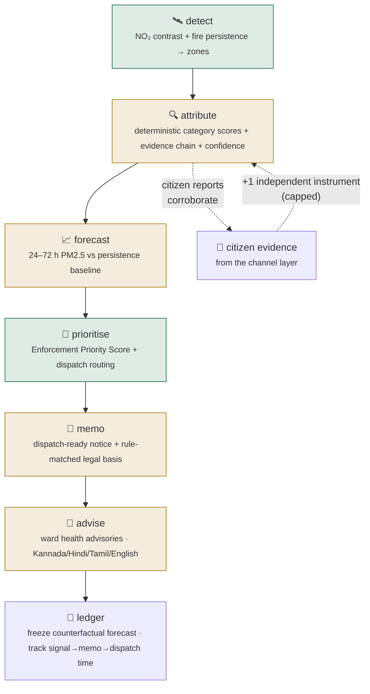
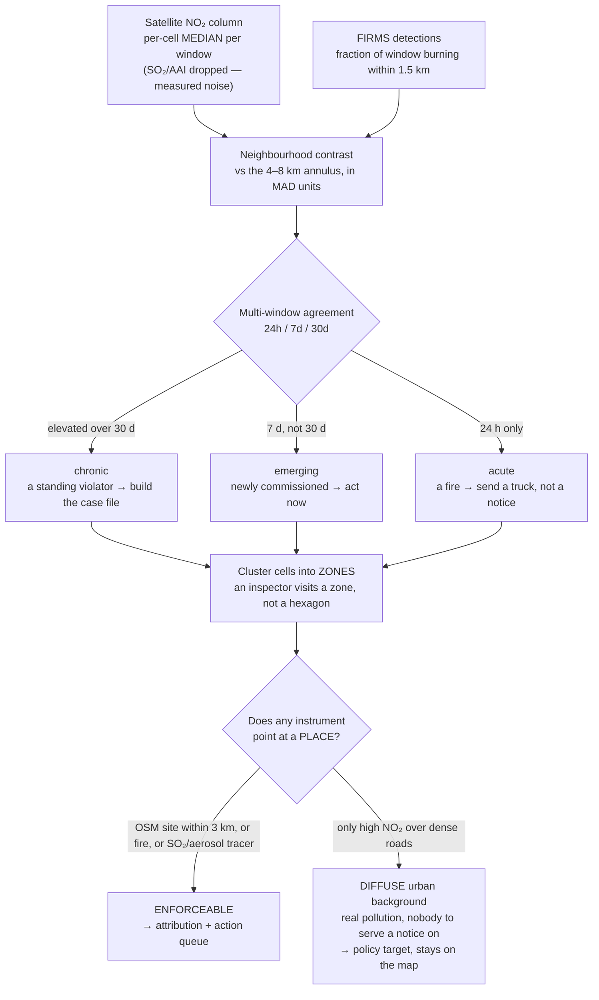

<p align="center">
  
</p>

<p align="center">
  
  
  
  
  
  
  
  
</p>

**An air quality platform that names *who* is polluting, *where*, with *what
evidence*, and *what to do about it today* — not another map of how bad the air
is.**

India does not have a monitoring problem; it has an action problem. Over 900
CAAQMS stations exist, yet a 2024 CAG audit found only **31%** of monitored
cities had any actionable response protocol. Meanwhile the monitors themselves
lie about coverage: CPCB siting norms deliberately place them *away from
sources*, so the official map is a **measurement log, not a pollution census**.

This platform detects sources from instruments that cover **every cell equally**,
names them with an inspectable evidence chain, and reports honestly on what it
**cannot** see.

---

## Run it in under a minute

No API keys. No cloud account. The whole pipeline runs offline against a
synthetic world with known ground truth, so every number below is reproducible on
your machine right now.

```bash
pip install -r requirements.txt
$env:PYTHONPATH = "."                                    # PowerShell (bash: export PYTHONPATH=.)

python scripts/run_pipeline.py --synthetic --full        # ingest → panel → fusion → detect → attribute
python scripts/eval_detection.py                         # THE headline stat
```

Then serve it:

The `--full` run drives the whole **7-agent pipeline** and writes every JSON
contract (`hotspots`, `attributions`, `forecast`, `actions`, `dispatch`, `memos`,
`advisories`, `ledger`) to `data/outputs/`. Then serve it:

```bash
uvicorn app.backend.main:app --reload --port 8000        # 20+ endpoints: /hotspots, /attribution/{cell}, /actions, /dispatch, /ledger, /advisories …
```

> **The API is real and read-only; the React/Leaflet console is the active build.**
> The channel layer (n8n citizen bot + inspector loop) is **live and deployed**. See
> [what's real vs prototype](#whats-real-vs-prototype) — we'd rather tell you than
> let you find out.

---

## The headline result

**On real data.** Delhi, November 2025 — real Sentinel-5P, real NASA FIRMS, real
CPCB stations, real OpenStreetMap:

> ### 🔥 Bhalswa landfill → `waste_burning`, confidence 0.67
> *evidence: satellite fire detections in 30 hours (18% of the window);
> shallow boundary layer (120 m) trapping emissions*

A real polluter, in a real city, from public satellite data, with an evidence chain
**anyone can check** — google *"Bhalswa landfill fire November 2025"*.

(Okhla landfill → `traffic`; it genuinely sits on Mathura Road — defensible but
incomplete. Ghazipur → not detected: no fires in the window. We report all three.)

**On the synthetic world**, where ground truth exists and accuracy can actually be
*scored*, recall is reported by **what the instruments can physically see**:

| tier | recall |
|---|---|
| **direct — thermal fire** (waste burning) | **2/2 found and correctly named** — and **both appear on no map at all** |
| **NO₂, confounded** (industrial, traffic) | **0/4** — NO₂ is a real tracer, but the road network lifts it citywide, so a point source must out-shout its own neighbourhood |
| **no tracer at all** (construction) | **0/3** — coarse PM. Nothing sees it. |

Enforceable-**zone** precision **2/2**. Attribution **100%** (16/16, all
unregistered). ⚠️ Small n — never sell these as rates.

And the number the whole thing exists for:

> **An unbiased 12-monitor network catches a median of 1 source in 9.**
> It misses eight. That is not siting bias — that is *geometry*. A dozen sensors
> cannot cover a city, however honestly you place them.

### We used to claim 4/4. It was not real.

The two *industrial* sources were being found via **SO₂ contrast**. Then we pulled
the real satellite: **real S5P SO₂ over a city is noise** — 49% of readings are
*negative*, a physical impossibility, with a MAD 30× the median (SNR 0.7). TROPOMI's
SO₂ band is built for volcanoes; an urban factory is far below its floor. The
aerosol index is no better (SNR 1.0).

On real Delhi, scoring across all three channels flagged **470 of 1,703 cells — 28%
of the city — and 87% of those were driven by SO₂ or AAI noise.** We were
manufacturing enforcement targets out of retrieval error, and a genuinely burning
landfill ranked *below* them.

So we deleted both channels, and the industrial sources went with them. **4/4 → 2/4.**
Our simulation had given the instruments a signal they do not have — the same class
of error as [the 100% trap](#the-100-trap), one level deeper.

---

## How it works — the whole system at a glance

Three tiers: a **batch data platform** turns raw feeds into a feature table; a
**7-agent pipeline** turns that table into named sources, priorities, memos and
advisories; a **read-only serving layer** exposes precomputed JSON that the
frontend and channels consume. Heavy compute never touches a request handler.

```mermaid
flowchart LR
    subgraph SRC["① Ingestion — 6 free sources, live + synthetic fallback"]
        direction TB
        OAQ["OpenAQ · CPCB stations"]
        S5P["Sentinel-5P · NO₂/SO₂/aerosol"]
        FIR["NASA FIRMS · thermal fires"]
        MET["Open-Meteo · wind + BLH"]
        OSM["OpenStreetMap · industry, roads"]
        CIT["Citizens · Telegram + web<br/>(n8n → Supabase)"]
    end

    SRC --> PANEL["② Panel<br/>H3 cell × hour feature table"]
    PANEL --> FUSION["Fusion field · LightGBM"]
    PANEL --> AGENTS

    subgraph AGENTS["③ Agent pipeline (LangGraph · 7 nodes)"]
        direction LR
        DET["detect"] --> ATT["attribute"] --> FC["forecast"] --> PR["prioritise"] --> MO["memo"] --> AD["advise"] --> LG["ledger"]
    end

    FUSION -->|"EXPOSURE · what people breathe"| API
    AGENTS -->|"SOURCES · who to inspect, what to do"| API
    API["④ Read-only FastAPI<br/>precomputed JSON contracts"] --> FE["Frontend · React + Leaflet<br/>(building)"]
    API --> CH["Channels · n8n<br/>advisories, inspector loop"]

    style FE stroke-dasharray: 5 5
```



**LLMs explain. Deterministic code decides.** Category scores, priority scores,
and every ranking are plain reproducible arithmetic. An LLM may only write prose
explaining a score that was already computed — and if it disagrees with the
arithmetic, **the arithmetic wins and the LLM output is discarded.** Every
LLM path has a rule-based fallback with an identical output schema, so a missing
API key degrades the *prose*, never the *answer*. **This discipline holds even at
the edge** — the citizen-intake bot lets an LLM *extract* fields from a free-text
report, but deterministic code canonicalises the ward against the official list
and clamps the category before anything is stored (see the [citizen loop](#the-citizen-loop--from-a-phone-to-the-evidence-chain)).

---

## The agent pipeline — signal to action

One `LangGraph` state machine runs seven agents over a shared typed state. Each
node is wrapped so one failure degrades the output instead of killing the run; the
same graph backs both the batch pipeline and the API's `POST /run/agent`, so chain
order can never drift between them.



Green nodes are pure arithmetic; amber nodes call an LLM **for prose only**, each
with a rule-based fallback. Every agent writes a versioned JSON contract to
`data/outputs/` that the API serves read-only.

---

## Detection: why not the fusion field?

This is the most important thing in the repo, and it cost us a rewrite to learn.

The original design ran hotspot detection on the fusion field. **It cannot work,
and we measured why:**

```
Training stations see a mean source contribution of  0.25 µg/m³   (p99 = 6.7)
The rest of the city reaches                       210    µg/m³
Only 6 of 4,032 station-hours have a fire nearby — against 4,414 citywide
```

The model trains only on cells containing a station, and CPCB siting deliberately
places stations *away from sources* — the very fact the fusion layer's rationale
rests on. So it **never observes a source**, cannot learn a source response, and
(being a tree ensemble) **cannot extrapolate to one**: LightGBM predicts
piecewise-constant, so a cell whose NO₂ column is far above anything a station
ever saw gets the same prediction as the worst station. Its field is
background-dominated by construction.

**The fusion field is an exposure map, not a detector.** It answers *"what is a
person in this cell breathing"* — which it does well (LOSO R² 0.90, ~36% better
than the station-mean map) and which is a genuinely useful product.

Detection instead runs on the two instruments with **uniform coverage — every
cell, no siting bias:**



Three rules hold this together:

- **Never the mean.** Every aggregate is a **median**, every spread a **MAD**. In
  this domain the outliers *are* the phenomenon: a mean lets one spike hour
  manufacture a chronic source out of a single bonfire.
- **One window is not a signal.** A real-time spike is noise. A source is what is
  still there when you zoom out.
- **Contrast, not rank.** Compare a cell to *its own neighbourhood*, not to the
  city. "This district is dense" is true, unactionable, and not a violator.

---

## The citizen loop — from a phone to the evidence chain

Citizens are a third observation tier — *"900 stations + 2 satellites + a million
human sensors"* — and, uniquely, the only instrument that can see the construction
dust the satellite is blind to. The intake is a live Telegram bot (and a web form
against the same endpoint), deployed on n8n behind automatic HTTPS.

```mermaid
flowchart LR
    U["📱 Citizen<br/><small>“Bhalswa mein kachra<br/>jal raha hai”</small>"] --> TG["Telegram / web form"]
    TG --> N8N

    subgraph N8N["n8n workflow — channels stay DUMB"]
        direction TB
        RT["Preprocess · route<br/><small>command? inspector? report?</small>"] --> GEM["Gemini · extract<br/><small>{category, ward_guess}</small>"]
        GEM --> FIN["Finalize · DECIDE<br/><small>canonicalise ward vs 733 official names;<br/>clamp category; keyword fallback</small>"]
    end

    FIN --> SUP["🗄️ Supabase<br/><small>citizen_reports (RLS: anon insert-only)</small>"]
    SUP --> SYNC["sync_supabase.py<br/><small>→ data/outputs/</small>"]
    SYNC --> ATT["🔍 attribute<br/><small>matches by ward + evidence window</small>"]
    ATT --> EV["Evidence chain<br/><small>“1 citizen report of waste_burning”<br/>confidence 0.77 → 0.84</small>"]

    classDef llm fill:#a9760a22,stroke:#a9760a;
    classDef det fill:#0f6b3f22,stroke:#0f6b3f;
    class GEM llm
    class FIN,SYNC,ATT det
```



**Proven end-to-end**, not just wired. A live report against a detected
`waste_burning` zone lifts its confidence **0.77 → 0.84** and adds
*"Citizen reports of waste burning"* to its evidence factors — because it counts as
**one more independent agreeing instrument** (fire + citizen = 2), computed by
deterministic math. The lift is **capped**: a brigade of reports can never
manufacture a source or out-shout the satellite. Reports outside the evidence
window, or that match no real ward, correctly do **not** corroborate.

The same bot carries the **inspector loop** — an inspector replies `done <id>`, the
status is written back, and the ledger stamps the response time. Two audiences, one
channel; the channel moves bytes and nothing more.

---

## What's real vs prototype

Because a README that oversells is the same bug as a metric that oversells.

| | Status |
|---|---|
| Ingestion — Sentinel-5P, OpenAQ, Open-Meteo, FIRMS, OSM | ✅ **all real and live.** Run end-to-end on Delhi, Nov 2025 |
| H3 spatial fabric + real ward boundaries | ✅ real (official Datameet GeoJSON for Bengaluru/Delhi/Chennai; Voronoi fallback) |
| Detection (NO₂ contrast + fire persistence) | ✅ real — validated on a real landfill fire |
| Attribution + evidence chain + confidence | ✅ real, truth-scored, calibrated |
| Forecast — 24/48/72 h vs persistence baseline | ✅ real. Gradient boosting; **27–28% RMSE skill vs persistence** on synthetic. On real Delhi the *direction* is the finding: persistence wins ≤24 h, the model wins 72 h (the enforcement-scheduling window) |
| Prioritisation (EPS) + dispatch routing | ✅ real — deterministic score, greedy set-cover, per-team routes |
| Enforcement memo + rule-matched legal basis | ✅ real — deterministic legal citation, LLM drafts prose only |
| Ward advisory agent — Kannada/Hindi/Tamil/English | ✅ real, with **per-language verification labels** (native-speaker vs cross-checked — never claims a review it didn't get) |
| Intervention ledger — response time + counterfactual | ✅ real. Response-time is honest (CAG's *weeks* vs one automated batch); effectiveness freezes the +48 h counterfactual, `our_impact: null` until a real intervention exists |
| Channels — n8n citizen intake + inspector loop | ✅ **live.** Telegram bot + web webhook → Supabase, proven end-to-end into the evidence chain |
| Read-only serving API (20+ endpoints) | ✅ real |
| **Fusion exposure field** | ❌ **claim withdrawn.** On real Delhi it is **14% worse than a naive city-mean** (RMSE 75.4 vs 66.0). We tried predicting the *deviation* from the city median — a construction that cannot lose to the baseline — and it still lost, which means the spatial model has **no transferable skill** across held-out stations. We do not claim it. |
| **Frontend — React + Leaflet console** | 🔨 **in progress.** API + JSON contracts are real; the map/queue UI is the active build. Screenshots below once it lands. |
| GEE Sentinel-5P collector | ✅ **built and wired** — real `COPERNICUS/S5P` extraction; it produced the real Delhi result. Live satellite needs GEE auth on the run machine (`gcloud auth application-default login`); until then synthetic mode runs fully offline |
| Voice advisory **audio** (TTS) | 🔨 text + voice mapping on `main`; audio synthesis on `feature/voice-advisories`, pending a native-speaker listen before merge |

> ### ⚠️ Live mode refuses to fake anything
> If the satellite, fire, or OSM collector fails, the pipeline **raises rather than
> substituting synthetic data**. Each of those layers *invents a place we would then
> accuse* — a fabricated output, not a degraded one. (Stations may degrade: they
> feed the exposure map, not the detector.)
>
> ### ⚠️ Don't run it in monsoon
> July is the worst possible month for both instruments: cloud masks 71% of the NO₂
> retrieval, and **nothing burns when it is wet** — real FIRMS returns **2 fires over
> Bengaluru in 60 days** (our synthetic world had 281). Both channels go blind.
> Delhi's burning season is **October–November**, which is where the real result
> above comes from.

---

## See it running

> 🖼️ **Screenshots land here once the frontend ships.** Placeholders name the shot
> so the story reads even before the images are attached.

| | |
|---|---|
| **Admin console — the map** | _`docs/img/console-map.png`_ · fusion choropleth + hotspot zones + fires, with the layer toggles and the +72 h forecast time-slider |
| **Action Queue → evidence chain** | _`docs/img/evidence-chain.png`_ · an EPS-ranked card expanded to *"why this hotspot"* — the inspectable evidence, including citizen corroboration |
| **One-click enforcement memo** | _`docs/img/memo.png`_ · the dispatch-ready notice with its rule-matched legal citation |
| **Citizen bot, live** | _`docs/img/telegram-loop.png`_ · a Hinglish report in, `ward: BHALSWA · waste_burning` out — the shot below is real today |
| **Live agent progress (SSE)** | _`docs/img/agent-strip.png`_ · the seven agents streaming *running → completed* during a pipeline run |

The Telegram loop is already demonstrable end-to-end:

```
Citizen:  Bhalswa mein kachra jal raha hai
AQIntel:  Report received - ward: BHALSWA, category: waste_burning.
          If it corroborates an inspection you will hear back here.
```

---

## The 100% trap

This project once reported **100% attribution accuracy**. It was an artefact, and
the story is worth the two minutes.

The synthetic world was emitting its hidden sources straight into the OSM layer
with **exact coordinates and exact category labels**, and dispersing them with the
*same* `exp(-d/2)·wind_alignment` kernel the attribution scorer uses. The scorer
was being handed the answer key and congratulated for reading it.

`ingestion/synthetic.py` is now deliberately **adversarial**:

- **different physics** — a Gaussian plume the scorer does not assume
- **sources that appear on no map at all** (illegal burning files no paperwork)
- **decoy sites** that are on the map and emit nothing
- **a satellite blurred to its true ~5.5 km footprint**
- **column-vs-surface decoupling** — the satellite sees no boundary-layer trapping;
  a station does. Bridging that gap is the fusion model's actual job

The score collapsed. *That collapse was the finding.* Every number in this README
survived the rebuild.

We caught the same class of error a second time: the stat *"0 of 9 sources sit
within 2 km of a monitor"* was **guaranteed by the world model's own placement
rule** (~99% true by construction) and was being reported as a discovery. It has
been replaced by the unbiased-network number above, which owes nothing to any
assumption we made.

> **If a number ever comes back at 100%, assume leakage before you assume success.**

---

## Repo layout

```
app/            backend/main.py — read-only FastAPI (20+ contracts)
                frontend/       — React + Vite + Leaflet console (in progress)
ingestion/      collectors (6 sources, live + synthetic fallback)
                preprocessing/panel.py — the cell × hour feature table
                synthetic.py — the adversarial hidden-source world
intelligence/   orchestrator.py     — the 7-agent LangGraph state machine
                models/fusion.py    — LightGBM exposure field
                models/signals.py   — robust multi-window statistics
                agents/             — detect, attribution, forecast, prioritise,
                                      memo, advisory, ledger + llm_gateway
shared/         config, H3 grid utilities, real ward layer (3 cities)
scripts/        run_pipeline.py, sync_supabase.py + truth-scored evaluations
db/             schema.sql — Supabase contracts the channel layer writes to
deploy/         n8n on GCP: Terraform + Caddy + DuckDNS runbook
docs/           architecture.md — the 9-layer design and why it's shaped this way
```

## Evaluations

Every claim in this README is a script you can run.

```bash
python scripts/eval_detection.py            # sources found vs missed; enforceable-zone precision
python scripts/eval_attribution.py          # accuracy, split registered vs unregistered; confidence calibration
python scripts/eval_station_sensitivity.py  # is the headline an artefact of where we put the monitors? (no)
python scripts/eval_hotspot_recovery.py     # fusion as an EXPOSURE map — and why it is not a detector
```

## Roadmap

**Done since the first draft** ✅ Sentinel-5P collector via Google Earth Engine
(built and wired — it produced the real Delhi result) · 7-agent LangGraph pipeline
(detect → attribute → forecast → prioritise → memo → advise → ledger) · real
Datameet ward boundaries for three cities · n8n citizen intake + inspector loop,
live and proven into the evidence chain · multi-language advisory *text* with honest
per-language verification labels.

**Landing now — built on feature branches, merging to `main`:**

- [ ] **Frontend** (`feature/frontend-app`) — React + Leaflet console + citizen view; typed API client with static-JSON fallback; memo/report buttons already call `POST /memo/{id}` and `POST /reports`. Merge + smoke-test against the live API.
- [ ] **Voice advisories** (`feature/voice-advisories`) — the advisory *text* + Google-TTS voice mapping ship on `main`; the **audio synthesis** and `/voice` endpoint are on the branch, pending a native-speaker listen before merge.

**Genuinely still ahead:**

- [ ] **Live satellite needs GEE auth on the run machine** — the collector is done; `gcloud auth application-default login` (see `docs/gcp-setup.md`) is the one manual step. Until then, synthetic mode runs fully offline.
- [ ] Sentinel-2 optical change detection → close the construction blind spot (S5P never will)
- [ ] Kannada advisory text is `cross_checked`, not native-verified — ten minutes with a Kannada speaker upgrades it

---

## Contributors

<p align="center">
  
  
  
  
</p>

| Contributor | Focus areas |
|---|---|
| **Saumya Saraswat** | Intelligence, with inputs on Frontend |
| **Suyash Mittal** | EPS, Deployment |
| **Keshav Agarwal** | Backend, Frontend, Agents |
| **Shyamsundar Paramasivam** | Backend, Frontend |


---

<p align="center">
  <sub>Built for a hackathon. The hardest engineering here wasn't the models — it was
  building an evaluation honest enough to tell us the models were wrong.</sub>
</p>
